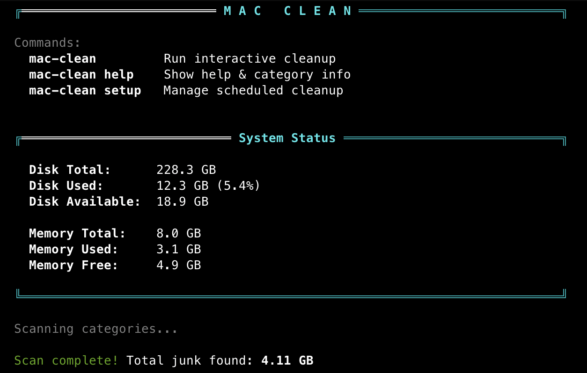

# macOS Cleanup Tool

Interactive shell script to clean junk files and free disk space on macOS.

## Quick Install

### curl (one-liner)

```bash
curl -fsSL https://raw.githubusercontent.com/Dheph/mac-clean/main/install.sh | bash
```

Installs to `~/.local/bin/mac-clean` and runs the setup for alias + scheduling.

### Homebrew

```bash
brew install https://raw.githubusercontent.com/Dheph/mac-clean/main/Formula/mac-clean.rb
```

Or add the tap and install:

```bash
brew tap Dheph/mac-clean
brew install mac-clean
```

### Manual

```bash
git clone https://github.com/Dheph/mac-clean.git ~/mac-clean
~/mac-clean/mac-cleanup.sh
```

## Commands

| Command | What it does |
|---------|-------------|
| `mac-clean` | Open interactive cleanup menu |
| `mac-clean help` | Show help, categories, and usage info |
| `mac-clean setup` | View or change scheduled cleanup |

## Features

- **16 cleanup categories** — Trash, Caches, Logs, Xcode, Homebrew, Node.js, Python, Docker, Spotify, and more
- **System Status Dashboard** — shows disk usage and memory before and after cleanup
- **Interactive menu** — select exactly what to clean, confirm each operation
- **Safe mode** — nothing is removed without confirmation
- **Final report** — shows exactly how much space was recovered
- **Scheduled cleanup** — optional weekly/bi-weekly/monthly routine via `launchd`

## Screenshots

| | |
|---|---|
| **mac-clean** — main menu with system status and all categories | **mac-clean help** — help and category reference |
|  |  |
| **mac-clean select-categories** — choosing specific categories with one-click confirm | **mac-clean setup** — schedule management (view, change, remove) |
|  |  |

## Scheduling

Set up a **recurring cleanup routine** — you can do it right from the tool:

```bash
# Create or change schedule:
mac-clean setup
```

The same menu also lets you view your current schedule, change frequency, or remove it.

| Option | When it runs |
|--------|-------------|
| Weekly | Every Monday at 10 AM (configurable day) |
| Bi-weekly | Every 14 days |
| Monthly | 1st of each month at 10 AM |

It uses macOS `launchd` — zero overhead, no extra processes. On schedule, a Terminal window opens with the cleanup menu ready.

```bash
# Quick start from scratch (alias + schedule in one go):
source start.sh
```

## Categories

| # | Category | Description |
|---|----------|-------------|
| 1 | Trash | User trash |
| 2 | System Caches | `/Library/Caches` |
| 3 | User Caches | `~/Library/Caches` |
| 4 | System Logs | `/Library/Logs`, `/var/log` |
| 5 | User Logs | `~/Library/Logs` |
| 6 | Temporary Files | `/tmp`, `/private/tmp` |
| 7 | Xcode DerivedData | Build artifacts and archives |
| 8 | Homebrew Cache | Brew download cache |
| 9 | Node.js Cache | npm, yarn, pnpm caches |
| 10 | Python Cache | pip cache |
| 11 | Docker Unused Data | Unused images, containers, volumes |
| 12 | Spotify Cache | Spotify cached audio |
| 13 | Time Machine Snapshots | Local TM snapshots |
| 14 | iOS Backups | Device backup files |
| 15 | Mail Downloads | Mail.app attachments |
| 16 | .DS_Store Files | Hidden metadata files |

## Project

```
mac-clean/
├── mac-cleanup.sh       # Main cleanup tool
├── start.sh             # Local installer & scheduler
├── install.sh           # curl-based installer
├── assets/
│   ├── mac-clean.png
│   ├── mac-clean help.png
│   ├── mac-clean select-categories.png
│   └── mac-clean setup.png
├── Formula/
│   └── mac-clean.rb     # Homebrew formula
└── README.md
```

## Requirements

- macOS (tested on Ventura / Sonoma / Sequoia)
- Bash 3.2+

## License

MIT
